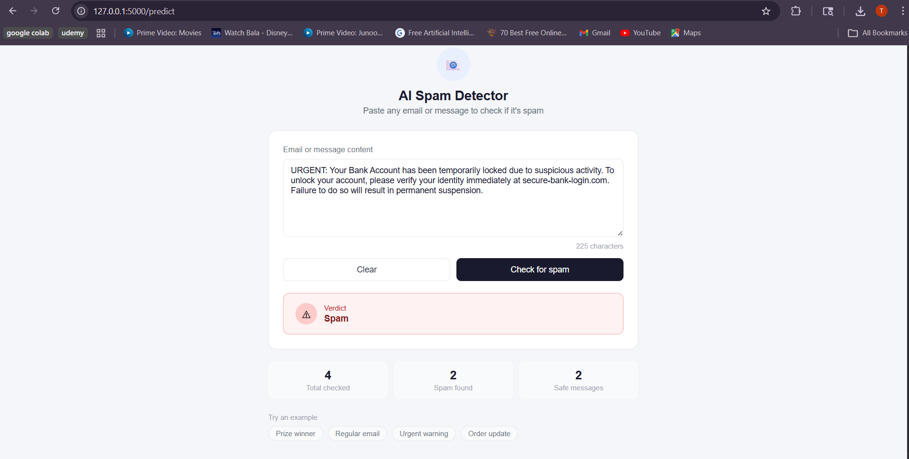

# 📧 AI Spam & Phishing Detector

## 🚀 Overview

An end-to-end machine learning application built using PyTorch that detects spam and phishing emails in real-time.  
The project includes data preprocessing, model training, API development, and a user-friendly web interface.

---

## 🧠 Features

- 🔍 Text preprocessing using NLTK
- 📊 TF-IDF vectorization for feature extraction
- 🤖 Deep learning model built with PyTorch
- ⚡ Real-time spam detection
- 🌐 Flask-based web interface
- 📡 API support for integration
- 📈 Achieved **96.62% accuracy**

---

## 🛠️ Tech Stack

- Python
- PyTorch
- Scikit-learn
- NLTK
- Flask
- HTML/CSS

---

## 📊 Model Performance

- ✅ Accuracy: **96.62%**
- 📉 Loss decreases steadily during training
- 📌 Handles real-world spam patterns effectively

---

## 🖥️ User Interface

### 🟢 Not Spam Example


### 🔴 Spam Example



---

## ⚙️ How to Run the Project

### 1️⃣ Clone the repository

```bash
git clone https://github.com/your-username/ai-phishing-detector.git
cd ai-phishing-detector
```
